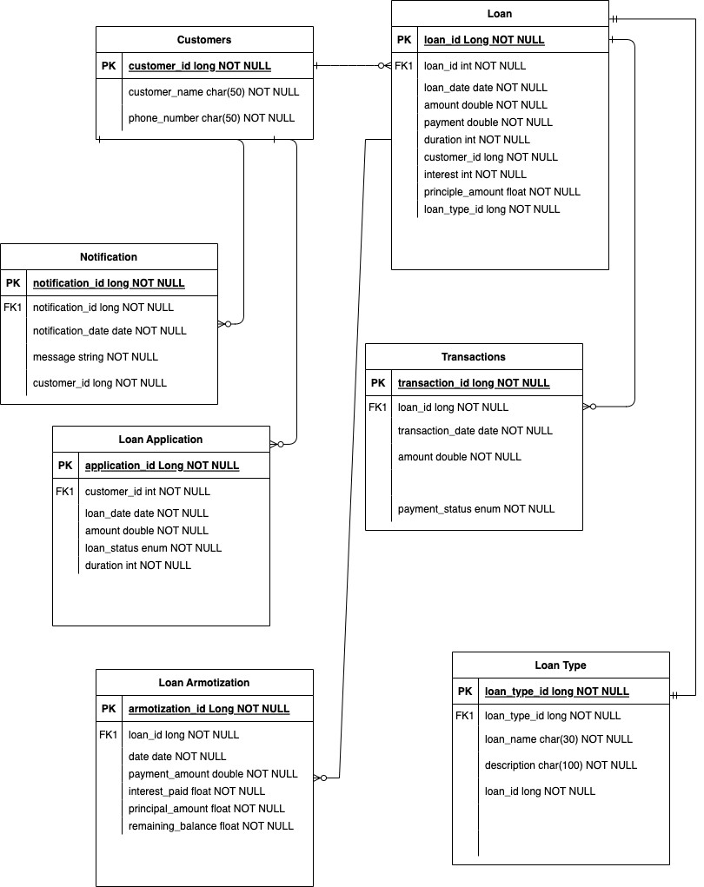

##Loan Repayments
### Database Schema

### User Action 

- customer application of the loan 
- Approval by the system
- send notifications 
- start loan repayments 
- if the loan  is short term duration less than 12 months and customer has made payment consistently for last three months
 then the customer can apply for another loan
- customer cannot have more than 3 active loans 

